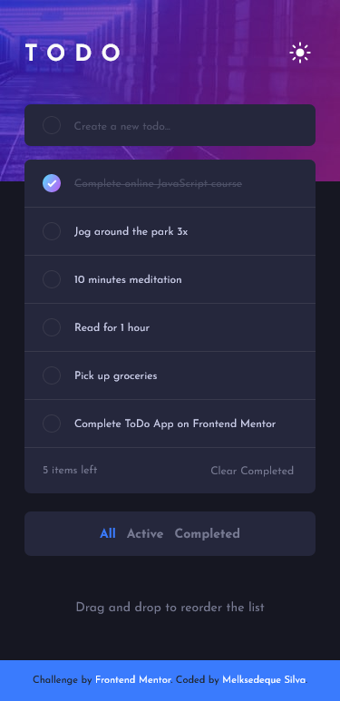

# Frontend Mentor - Todo app solution

This is a solution to the [Todo app challenge on Frontend Mentor](https://www.frontendmentor.io/challenges/todo-app-Su1_KokOW). Frontend Mentor challenges help you improve your coding skills by building realistic projects. 

## Table of contents

- [Overview](#overview)
  - [The challenge](#the-challenge)
  - [Screenshot](#screenshot)
  - [Links](#links)
- [My process](#my-process)
  - [Built with](#built-with)
  - [What I learned](#what-i-learned)
  - [Continued development](#continued-development)
  - [Useful resources](#useful-resources)
- [Author](#author)

## Overview

### The challenge

Users should be able to:

- [x] View the optimal layout for the app depending on their device's screen size
- [x] See hover states for all interactive elements on the page
- [x] Add new todos to the list
- [x] Mark todos as complete
- [x] Delete todos from the list
- [x] Filter by all/active/complete todos
- [x] Clear all completed todos
- [x] Toggle light and dark mode
- [-] **Bonus**: Drag and drop to reorder items on the list

### Screenshot





### Links

- Live Site URL: [Add live site URL here](https://melksedeque.github.io/todo-list-app/)

## My process

### Built with

- Semantic HTML5 markup
- CSS custom properties
- [Flexbox](https://css-tricks.com/snippets/css/a-guide-to-flexbox/) - Flexbox
- CSS Grid
- Sass / SCSS
- Mobile-first workflow
- jQuery 3.6.4
- [Bootstrap](https://getbootstrap.com/) - Bootstrap 5.2.3

### What I learned

With this project, I learned how to use the draggable attribute in HTML and JavaScript to reorder the task list. It was so simple to learn that I was surprised to see it working from the start.

The function below is what gave me headaches for a couple of weeks. I was struggling to find out how to generate an ID for the task item that wouldn't be rewritten when I reload the page or when I clear the completed tasks.

```js
function generateId(length) {
    let result = ''
    const chars = 'abcdefghijklmnopqrstuvwxyz0123456789'
    const charsLength = chars.length
    let i = 0
    while (i < length) {
      result += chars.charAt(Math.floor(Math.random() * charsLength))
      i += 1
    }
    return result
}
```

Within the loop, a random character is generated from the character string. The Math.random() function generates a random number between 0 and 1, which is multiplied by charsLength and passed to the Math.floor() function to round to the nearest integer. Then, the corresponding character is added to the result variable using the charAt() function.

### Continued development

Now I'm gonna focus on JavaScript to make this project better and create new and more complexes projects to develop myself.

### Useful resources

- [Bootstrap](https://getbootstrap.com/) - Bootstrap 5.2.3 - Used to create the CSS Grids and to use the preformatated CSS classes in the project instead of rebuild all the CSS Elements.
- [Flexbox](https://css-tricks.com/snippets/css/a-guide-to-flexbox/) - Flexbox - Used to size and position the elements.

## Author

- Website - [Melksedeque Silva](https://github.com/Melksedeque/)
- Frontend Mentor - [@Melksedeque](https://www.frontendmentor.io/profile/Melksedeque)